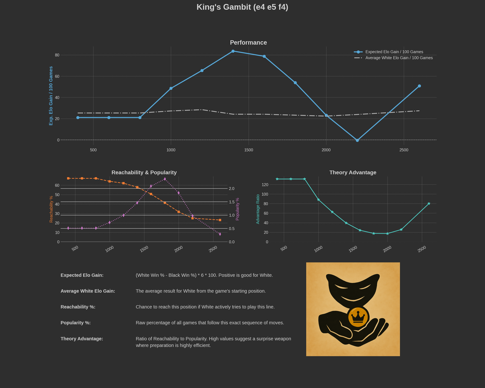
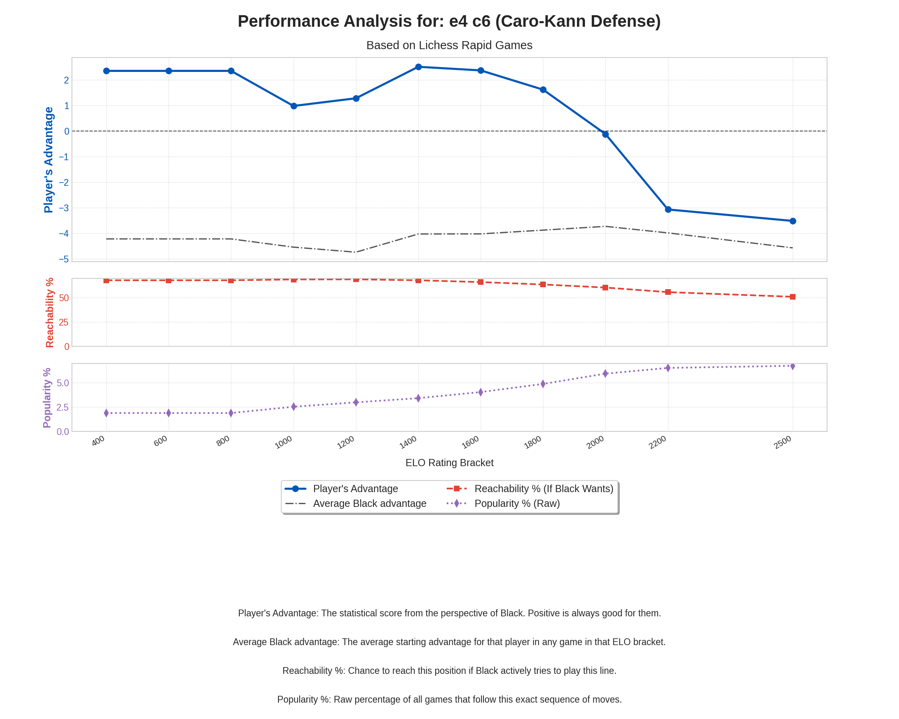

# WickedLines – Chess Opening Reachability & Value Explorer

WickedLines is a command-line tool for analyzing chess opening lines using the Lichess game database. It has three primary modes:

    line mode: A deep-dive analysis of a single, specific opening variation.

    hunt mode: An automatic, recursive search to discover statistically significant opportunities and blunders hidden in opening lines.

    plot mode: Visualizes an opening's performance and popularity across different ELO levels.

The tool helps you prioritize your study by focusing on variations that are reachable, statistically sound, and offer the greatest practical impact on your rating.

## Hunt Results

All reports generated by the `hunt` command are saved in the `hunt_results/` directory.

### [Click here to see the master index of all hunt reports](HUNT_INDEX.md)

---

## Key Concepts

### Reachability ("If Wants %")
This metric calculates the probability of reaching a position assuming one player actively tries to steer the game towards it, while their opponent's moves follow the database's overall frequencies. It answers, "How often can I realistically get this position on the board?"

### Popularity % (Raw)
This is a simpler metric that shows what percentage of *all* games starting from the initial position follow the specified sequence of moves. It answers, "How common is this line in general practice?" and is plotted on a separate chart for clarity.

### Expected Value (EV)
A metric to judge a position's statistical value, calculated from the win/draw/loss percentages. A positive EV favors White; a negative EV favors Black.

### Delta EV (ΔEV)
Shows how the EV changes after a specific move, indicating its statistical quality. A positive ΔEV is good for White; a negative ΔEV is good for Black.

### Statistical Significance (p-value)
This is a crucial filter. It answers the question: "Could this move's high win rate be due to pure random chance?" A low p-value (typically **< 0.05**) suggests the result is statistically significant and trustworthy, not just a fluke from a small sample size. The `hunt` mode will only report on moves that meet this significance threshold.

### Expected ELO Gain / 100 Games
This is the ultimate metric for practicality. It combines a move's reachability with its statistical impact (ΔEV) to estimate the concrete rating point gain you could expect over 100 games by learning and playing this opportunity. It is calculated as:
`Reachability % * |ΔEV| * ELO_Factor`

## Installation

1.  Ensure you have Python 3 installed.
2.  Install the required libraries (including the new `scipy` dependency):

    pip install requests python-chess tabulate scipy

3.  Save the script (`wickedlines.py`).

## Usage

WickedLines now operates with two main commands: `line` and `hunt`.

### `line` Mode: Analyze a Single Line

Use this for a detailed breakdown of one specific variation.

**Syntax:**

    python wickedlines.py line [moves...] [options...]

**Example:**

    python wickedlines.py line e4 e5 Nf3 Nc6 Bb5

### `hunt` Mode: Find Opportunities

Use this to automatically search for high-impact moves.

**Syntax:**

    python wickedlines.py hunt [initial_moves...] [options...]

**Examples:**

    # Hunt for opportunities right from the start
    python wickedlines.py hunt

    # Hunt for opportunities within the Ruy Lopez
    python wickedlines.py hunt e4 e5 Nf3 Nc6 Bb5

    # Run a quick hunt that stops after finding 5 lines
    python wickedlines.py hunt --max-finds 5

### `plot` Mode: Visualize a Line's Performance

Use this to see how an opening's effectiveness, reachability, and general popularity change across different skill levels.

**Syntax:**

    python wickedlines.py plot [moves...] [options...]

**Example:**

    # Plot the performance of the King's Gambit in rapid games
    python wickedlines.py plot e4 e5 f4 --speed rapid

### Command-Line Arguments
*   `moves`: A sequence of moves in SAN. Required for `line` mode, optional for `hunt` mode.
*   `--ratings`: (Optional) Comma-separated rating brackets. Default: `1400,1600,1800`.
*   `--speeds`: (Optional) Comma-separated time controls. Default: `blitz,rapid,classical`.
*   `--max-finds N`: (For `hunt` mode) Stop the search after finding `N` interesting lines.

## How to Read the Output

### `line` Mode Output
This mode provides a full breakdown of a single line, including:
1.  **Line Reachability Stats:** A move-by-move table showing how reachability and EV evolve. The key move that was found in a hunt will be marked with `<-- Interesting`.
2.  **Final Position Summary:** A snapshot of the final position's stats and a link to the Lichess analysis board.
3.  **Next Move Statistics:** A table of all legal replies from the final position, including their `ΔEV` and `p-value` to help you choose the best response.

### `hunt` Mode Output

The hunt mode is designed for discovery and has three phases:

**1. Initial Line Analysis (if applicable)**
If you provide an initial move sequence, the hunt will first run a full `line` analysis on it.

**2. Live Search Log**
You will see a real-time log of the search progress. When an interesting line is found, its full `line` analysis is printed immediately inside a colored banner.

**3. Final Hunt Summary**
At the end of the hunt (or when you press `Ctrl+C`), a final summary is printed. It ranks all found opportunities by their **Expected ELO Gain**, providing a prioritized list of what to study.

The summary is presented as a series of "cards" for readability:

    --- Hunt Summary ---
    Top opportunities ranked by expected ELO gain over 100 games:

    1. ELO Gain/100: +9.42 | Reachable: 10.07% | Move: f5    | ΔEV: -12.4 (good for Black)
       Line: e4 e5 Nf3 Nc6 Bb5 f5 (Ruy Lopez: Schliemann Defense)
       URL:  https://lichess.org/analysis/pgn/1.e4%20e5%202.Nf3%20Nc6%203.Bb5%20f5

    2. ELO Gain/100: +3.54 | Reachable: 23.06% | Move: d4    | ΔEV: +6.4 (good for White)
       Line: e4 e5 Nf3 Nc6 Bb5 d6 d4 (Ruy Lopez: Steinitz Defense)
       URL:  https://lichess.org/analysis/pgn/1.e4%20e5%202.Nf3%20Nc6%203.Bb5%20d6%204.d4

    ...

This format allows you to quickly identify the most profitable lines to add to your repertoire.

### `plot` Mode Output
This mode generates a professional, two-part figure that visualizes an opening's performance and usage statistics across ELO brackets. The plot is displayed on-screen and also saved to the `plots/` directory.

The figure is split into two charts that share the same ELO x-axis for easy comparison:

**1. Top Chart (Performance vs. Reachability)**
*   **Expected Value (EV):** The main blue line, showing the statistical score of the position at each ELO level.
*   **Reachability %:** The dashed red line, plotted against the right-hand y-axis. It shows how often a player can expect to get this line if they actively try for it.

**2. Bottom Chart (Overall Popularity)**
*   **Popularity % (Raw):** This purple dotted line gets its own chart to make its typically smaller values clearly visible. It shows how often the line appears in the database out of all total games.

This layout allows for a clear, uncluttered view of the key metrics, helping you understand not only if an opening is good, but also how practical and common it is at different skill levels.