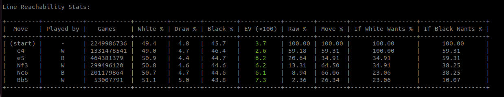
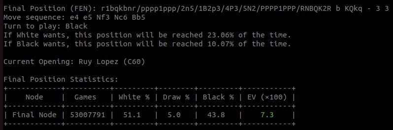

      
# WickedLines – Chess Opening Reachability & Value Explorer

This is a command-line tool for analyzing chess opening lines using the Lichess game database. It helps players prioritize their study by providing two key types of information for any given position:

1.  **Reachability**: How likely is it that this position will be reached in a real game?
2.  **Statistical Value**: What are the historical win, draw, and loss rates from this position?

The tool provides data to help you focus on variations that are both practically relevant and statistically sound.

## Key Metrics

### Reachability ("If Wants %")
This metric calculates the probability of reaching a position assuming one player actively tries to steer the game towards it, while their opponent's moves follow the overall frequencies in the database.

The logic is as follows:
*   At the start, both White and Black have a 100% chance of reaching the position.
*   When **White** plays a move (e.g., `e4`, played in 59.3% of games), White's "If Wants %" is not penalized. However, **Black's "If Wants %" is multiplied by the move's frequency** (`100% * 0.593 = 59.3%`), as Black is dependent on White making that specific move.
*   When **Black** replies (e.g., `e5`, played 34.9% of the time after `e4`), the reverse happens. Black's "If Wants %" is not penalized, but **White's "If Wants %" is multiplied by this frequency** (`100% * 0.349 = 34.9%`).

This provides a practical estimate of how often you can force a desired line.

### Expected Value (EV)
A metric to judge a position's statistical value, calculated as:
`EV = (+1 * White Win %) + (0 * Draw %) + (-1 * Black Win %)`

*   A positive EV indicates a statistical advantage for White.
*   A negative EV indicates a statistical advantage for Black.
The output is multiplied by 100 for readability (e.g., an EV of `+0.073` is displayed as `7.3`).

### Delta EV (ΔEV)
This shows how the `EV` changes after a specific move is played, indicating the move's statistical quality.
*   When it's **White's turn**, a positive ΔEV indicates a good move.
*   When it's **Black's turn**, a negative ΔEV indicates a good move.

## Installation

1.  Ensure you have Python 3 installed.
2.  Install the required libraries:
    ```bash
    pip install requests python-chess tabulate
    ```
3.  Save the script (`wickedlines.py`).

## Usage

Run the script from your terminal, followed by a sequence of moves in Standard Algebraic Notation (SAN).

**Syntax:**
```bash
python wickedlines.py [moves...] [options...]
```

**Examples:**

```bash
      
# Analyze the first 5 moves of the Ruy Lopez
python wickedlines.py e4 e5 Nf3 Nc6 Bb5

# Analyze the Queen's Gambit
python wickedlines.py d4 d5 c4

# Analyze only for blitz games between 2000-2200 rated players
python wickedlines.py e4 c5 --speeds blitz --ratings 2000,2200

# Get stats for the starting position
python wickedlines.py
```
    
**Command-Line Arguments**

    moves: A sequence of moves like e4 e5.

    --speeds: (Optional) Comma-separated list of Lichess time controls. Default: blitz,rapid,classical.

    --ratings: (Optional) Comma-separated list of Lichess rating brackets. Default: 1600,1800,2000,2200,2500.

    --no-line-tracking: (Optional) Skips the detailed line reachability table.

## How to Read the Output

The output is presented in three parts, using python wickedlines.py e4 e5 Nf3 Nc6 Bb5 as an example.
1. Line Reachability Stats

This table tracks the game's statistics move by move.


   


    Played by: Who made the move to reach this state.

    Games: Total games in the database that reached this position.

    EV (×100): The Expected Value, color-coded Green for White's advantage and Red for Black's.

    Raw %: The percentage of all games in the database that reach this position.

    Move %: The local frequency of the move from the previous position.

    If White/Black Wants %: The calculated reachability for each player.

2. Final Position Summary

A snapshot of the final position in the sequence. 



3. Next Move Statistics

This table shows the available moves from the final position.

      


    
    Move: The available moves. The statistically best option is annotated with <-- Best for....

    ΔEV: How much the EV changes. This is color-coded based on whose turn it is. Green indicates a favorable shift, Red an unfavorable one. In the example (Black to move), f5 has a ΔEV of -13.7, a large negative shift which is excellent for Black.

    Opening: The name of the variation this move leads to.

This table allows you to spot strong or underrated moves to add to your repertoire.